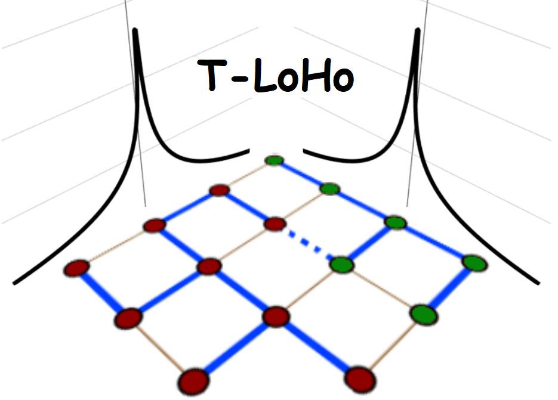

<!-- README.md is generated from README.Rmd. Please edit that file -->

# TLOHO


<!-- badges: start --> <!-- badges: end -->

TLOHO is an accompanying R package of the paper:

Lee, C. J., Luo, Z. T., & Sang, H. (2021). T-LoHo: A Bayesian
Regularization Model for Structured Sparsity and Smoothness on Graphs.
*Advances in Neural Information Processing Systems 34 (NeurIPS 2021)*

## Installation

You can install the development version from
[GitHub](https://github.com/) with:

``` r
# install.packages("devtools")
devtools::install_github("changwoo-lee/TLOHO")
```

## Example

### Running simulation in section 4.1

``` r
library(TLOHO)
library(fields)
data = generate_simdata(n=900, rhox = 0, SNR = 4, option = "twoclusters")
image.plot(matrix(data$beta.true, 30, 30))
require(igraph)
# construct lattice graph ----------------
graph0 = make_lattice(c(30,30))

fit <- tloho_lm(data$Y, data$X, graph0, Dahl = T)

plot(fit$log_post_out, type ="l")
plot(log(fit$tau2_out), type ="l")
image.plot(matrix(fit$median_beta_est, 30, 30))
image.plot(matrix(fit$cluster_est_Dahl, 30, 30))
```

``` r
# normal means
Y = data$beta.true + rnorm(900, sd = 1)

image.plot(matrix(Y, 30, 30))
fit2 <- tloho_lm_normalmeans(Y, graph0, Dahl = T)

image.plot(matrix(fit2$mean_beta_est, 30, 30))
image.plot(matrix(fit2$cluster_est_Dahl, 30, 30))
```
